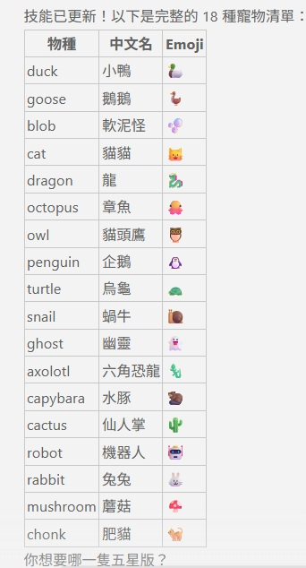

# 🐉 Claude Code Buddy Reroll

> 刷出你想要的 Claude Code `/buddy` 五星寵物



---

## 介紹

Claude Code 的 `/buddy` 功能可以領養一隻專屬寵物，但官方沒有提供重置入口。

本工具透過逆向分析寵物生成演算法，讓你暴力搜尋出能生成**指定物種 + legendary 稀有度**的 userID，寫入設定後重啟即可得到你想要的寵物。

---

## 原理

寵物的外觀、稀有度、屬性全部由以下公式確定性生成：

```
hash(userID + SALT)  →  Mulberry32 PRNG  →  寵物屬性
```

- **SALT**：`friend-2026-401`（Claude Code 2.1.89+）
- **Hash**：Claude Code 使用 Bun 打包，必須用 `Bun.hash()`，Node.js 的 FNV-1a 結果不同
- **userID 來源**：`oauthAccount.accountUuid` > `userID`（存於 `~/.claude.json`）

---

## 可用寵物

| 物種    | 中文名 | Emoji | 物種     | 中文名   | Emoji |
| ------- | ------ | ----- | -------- | -------- | ----- |
| duck    | 小鴨   | 🦆    | snail    | 蝸牛     | 🐌    |
| goose   | 鵝鵝   | 🪿    | ghost    | 幽靈     | 👻    |
| blob    | 軟泥怪 | 🫧    | axolotl  | 六角恐龍 | 🦎    |
| cat     | 貓貓   | 🐱    | capybara | 水豚     | 🦫    |
| dragon  | 龍     | 🐉    | cactus   | 仙人掌   | 🌵    |
| octopus | 章魚   | 🐙    | robot    | 機器人   | 🤖    |
| owl     | 貓頭鷹 | 🦉    | rabbit   | 兔兔     | 🐰    |
| penguin | 企鵝   | 🐧    | mushroom | 蘑菇     | 🍄    |
| turtle  | 烏龜   | 🐢    | chonk    | 肥貓     | 🐈    |

稀有度機率：common(60%) → uncommon(25%) → rare(10%) → epic(4%) → **legendary(1%)**

---

## 需求

- [Bun](https://bun.sh)（必須，不能用 Node.js）
- Claude Code（native 安裝版）

```bash
# 安裝 Bun（Windows PowerShell）
powershell -c "irm bun.sh/install.ps1 | iex"
```

---

## 使用方法

### 基本用法

```bash
# 找 legendary dragon（幾秒內完成）
bun buddy-reroll.js --species dragon --rarity legendary --count 1

# 找任意 legendary
bun buddy-reroll.js --rarity legendary

# 要閃光版（shiny）
bun buddy-reroll.js --species cat --rarity legendary --shiny

# 要所有屬性 >= 80
bun buddy-reroll.js --species duck --min-stats 80
```

輸出範例：

```
Runtime: bun (Bun.hash)
Searching: species=dragon, rarity>=legendary (max 50,000,000, find 1)

#1 [legendary] dragon eye=◉ hat=beanie shiny=false
   stats: DEBUGGING:41 PATIENCE:78 CHAOS:72 WISDOM:100 SNARK:74
   uid:   f33715816bd4d2337eee6c2170c8f28f422fd85cb7ebbb28acdf3b54825392e6

Found 1 match(es) in 0.0s
```

### 驗證 UID

```bash
bun buddy-reroll.js --check <uid>
```

---

## 寫入設定

### API Key 用戶

編輯 `C:\Users\{username}\.claude.json`（Windows）或 `~/.claude.json`（Mac/Linux）：

1. 將 `"userID"` 欄位改為找到的 uid
2. 刪除 `"companion"` 欄位（若存在）
3. 儲存並完全重啟 Claude Code
4. 執行 `/buddy` 領取

### OAuth 用戶（使用 Claude 帳號登入）

OAuth 登入時 `accountUuid` 會覆蓋 `userID`，需要特殊方式繞過：

**步驟 1**：在終端機執行取得 token

```bash
claude setup-token
```

**步驟 2**：替換 `~/.claude.json` 為最小設定並加入目標 userID

```json
{
  "hasCompletedOnboarding": true,
  "theme": "dark",
  "userID": "<找到的 uid>"
}
```

**步驟 3**：用環境變數啟動（讓 accountUuid 不被寫入）

```powershell
# Windows PowerShell
$env:CLAUDE_CODE_OAUTH_TOKEN="<你的token>"; claude
```

```bash
# Mac / Linux
CLAUDE_CODE_OAUTH_TOKEN="<你的token>" claude
```

**步驟 4**：執行 `/buddy` 領取 🎉

> **原理**：透過環境變數登入時，Claude Code 不會將 `accountUuid` 寫入 `~/.claude.json`，buddy 系統因此退回使用 `userID` 欄位。

---

## 選項說明

| 選項                    | 說明                                                            | 預設值     |
| ----------------------- | --------------------------------------------------------------- | ---------- |
| `--species <name>`    | 指定物種                                                        | 任意       |
| `--rarity <name>`     | 最低稀有度                                                      | 任意       |
| `--eye <char>`        | 眼睛樣式（`· ✦ × ◉ @ °`）                                | 任意       |
| `--hat <name>`        | 帽子（none/crown/tophat/propeller/halo/wizard/beanie/tinyduck） | 任意       |
| `--shiny`             | 要求閃光版（1% 機率）                                           | false      |
| `--min-stats [value]` | 所有屬性最低值                                                  | 90         |
| `--count <n>`         | 找到幾個結果                                                    | 3          |
| `--max <n>`           | 最大迭代次數                                                    | 50,000,000 |
| `--check <uid>`       | 查看指定 uid 對應的寵物                                         | —         |

---

## Claude Code Skill

本專案附帶 Claude Code skill，讓 AI 助手自動執行整個流程。

### 安裝方式一：npx（推薦）

```bash
npx skills add https://github.com/kevintsai1202/buddy
```

### 安裝方式二：手動複製

將 `buddy-reroll/` 資料夾複製到 `~/.claude/skills/`：

```bash
# Mac / Linux
cp -r buddy-reroll ~/.claude/skills/

# Windows PowerShell
Copy-Item -Recurse buddy-reroll $env:USERPROFILE\.claude\skills\
```

### 使用方式

安裝後直接對 Claude 說出你的需求，Claude 會互動詢問以下設定再執行：

| 項目 | 選項 | 預設 |
| ---- | ---- | ---- |
| **物種** | 🦆 duck / 🪿 goose / 🫧 blob / 🐱 cat / 🐉 dragon / 🐙 octopus / 🦉 owl / 🐧 penguin / 🐢 turtle / 🐌 snail / 👻 ghost / 🦎 axolotl / 🦫 capybara / 🌵 cactus / 🤖 robot / 🐰 rabbit / 🍄 mushroom / 🐈 chonk | 任意 |
| **稀有度** | common / uncommon / rare / epic / **legendary** | legendary |
| **眼睛** | `·` `✦` `×` `◉` `@` `°` | 任意 |
| **帽子** | none / crown / tophat / propeller / halo / wizard / beanie / tinyduck | 任意 |
| **閃光版** | yes / no | no |
| **屬性下限** | 數值（如 80 代表全屬性 >= 80） | 無限制 |

範例對話：

> 「幫我刷一隻 legendary dragon」
> 「我要閃光版的 legendary cat，帽子要皇冠」
> 「幫我找全屬性 90 以上的 legendary penguin」

Claude 就會自動執行腳本、判斷用戶類型、寫入設定。

---

## 注意事項

- 本工具基於 Claude Code **2.1.89 Native** 版本分析，其他版本若更改 SALT 或演算法需對應調整
- `userID` 僅用於遙測分析（匿名）、A/B 分桶、buddy 種子，與對話歷史、API key 完全無關，更換不影響任何功能
- 原始 `.claude.json` 建議備份：`cp ~/.claude.json ~/.claude.json.backup`

---

## 致謝

本工具基於以下社群研究成果，感謝原作者的逆向分析與分享：

- **[Claude Code /buddy 宠物系统逆向分析 —— 如何重置并刷到你想要的宠物](https://linux.do/t/topic/1871870)**
  by [@nemomen](https://linux.do/u/nemomen)（LINUX DO）
  — 核心逆向分析：SALT、hash 算法、userID 機制、reroll 腳本原型
- **[Claude Oauth登录刷 /buddy 宠物的方法找到了](https://linux.do/t/topic/1873901)**
  by [@NaynIruR / ruri39](https://linux.do/u/ruri39)（LINUX DO）
  — OAuth 用戶解法：`CLAUDE_CODE_OAUTH_TOKEN` 環境變數繞過 accountUuid

---

## 授權

MIT
